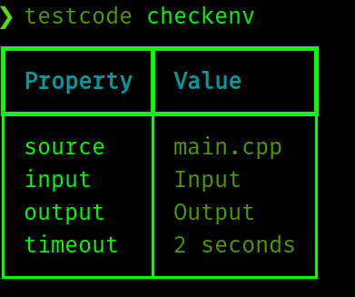

## Automate Code Testing (C/C++)

When conducting an unofficial programming contest, which doesn't involve any popular sites, This may come handy. People employ various methods, to test their participants. If you're testing manually, You should stop it. Right Away!

## What this does ?

As said, this is a python package and used as a command-line tool. Given testcases in a proper format, testcode runs the source code against all the inputs. Timeout is 2 seconds by default. You could increase it to large value, if you don't want to restrict with time constraints.

testcode has 2 sub-commands. Parameters to both sub-commands are same.

```bash
❯ testcode verify --help
Usage: testcode verify [OPTIONS]

  Runs the code against all the valid input test-cases

Options:
  -S, --source PATH            Path to source code. Extension should be either
                               .c or .cpp  [default: main.cpp]
  -I, --input PATH             Input directory for test-cases  [default: Input]
  -O, --output PATH            Output directory for test-cases  [default: Output]
  -T, --timeout INTEGER RANGE  Time Limit for each testcase  [default: 2;x>=1]
  --help                       Show this message and exit.

```

- checkenv
- verify

## checkenv

Prints the details given as parameters. As name said, It just checks if things are good.

**Sample Output**


## verify

Runs source code against input testcases and prints the verdict.

**Sample Output**

